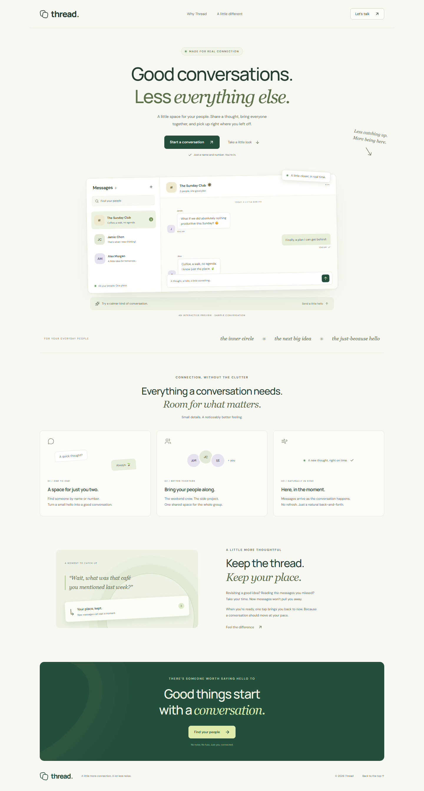

# Thread

**Good conversations. Less everything else.**

A responsive direct and group chat application, with an original landing page, built against the provided REST + Socket.io assignment API.

<!-- DEMO_LINKS -->

- **Landing page:** https://task-chat-mu.vercel.app
- **Chat application:** https://task-chat-mu.vercel.app/chat
- **Repository:** https://github.com/sajeeb-ahmeed/task-chat


<!-- /DEMO_LINKS -->

## Run locally

Requires Node.js 22 or newer and npm.

```sh
npm ci
cp .env.example .env.local
npm run dev
```

On Windows PowerShell, use `Copy-Item .env.example .env.local` in place of `cp`. Open http://localhost:3000. The default API origin is already configured; no private key or custom backend is needed. If using Vercel CLI, preserve any existing `.env.local` rather than replacing it.

```sh
npm run build
npm start
```

## Try the application

1. Open `/login` and enter a test name and an international test phone number. A new number creates an account; an existing number signs in.
2. In a separate browser profile/incognito window, sign in with another test identity.
3. Choose **New conversation**, search the other person's name or full phone number, and start a direct conversation.
4. Add a third identity to try group creation. Select at least two other people and give the group a name.
5. Send messages between sessions. Scroll up before an incoming message to see the **new message** button instead of a forced jump.

The assignment API has no password or OTP verification. Use synthetic identities and non-sensitive messages. Sessions and per-conversation drafts are stored in `sessionStorage`: refresh survives, separate tabs can use different identities, and closing the tab ends the stored session.

## What's included

- Phone/name login with automatic account creation and session restoration.
- Debounced user search, direct conversations, and groups with multiple participants.
- Paginated full history, sender identities, local timestamps, and duplicate-free real-time delivery.
- Whitespace prevention, pending feedback, preserved drafts, and careful handling of uncertain sends.
- Reading-position preservation for new messages **and** older-history pagination.
- Socket reconnect reconciliation and a visible 15-second polling fallback while disconnected.
- Loading, empty, network-error, unauthorized, and not-found states.
- Mobile conversation navigation, keyboard-accessible dialogs, visible focus, live message announcements, and reduced-motion support.
- An original landing page with a sample interaction showing the reading-position behavior.

## Stack and structure

Next.js App Router, React, TypeScript, TanStack Query, Socket.io client, Lucide icons, and plain CSS with shared design tokens. Vitest covers contract-sensitive logic; Playwright and axe cover browser behavior and accessibility.

```text
src/app/                 Routes, shared layout, styles and error boundaries
src/components/          Auth/query providers and shared visual primitives
src/features/chat/       Workspace, conversation creation, message panel, realtime hook
src/features/landing/    Interactive, clearly labeled sample preview
src/lib/                 API adapter, domain types, identity/message normalization
docs/api.md              API documentation written before implementation
docs/architecture.md     Data flow, decisions and known trade-offs
tests/                   Browser, failure-state and opt-in live integration tests
```

## Validation

```sh
npm run lint
npm run typecheck
npm test
npx playwright install chromium
npm run test:e2e
npm run build
```

The default browser suite uses the real frontend with deterministic error-state fixtures. The live integration suite is explicitly opt-in because it creates synthetic users and messages on the provided backend:

```sh
LIVE_CHAT_TESTS=1 npm run test:e2e
```

PowerShell: `$env:LIVE_CHAT_TESTS='1'; npm run test:e2e`. It exercises three independent sessions, name and formatted-phone lookup, direct/group delivery, inclusive pagination, scroll anchoring, draft isolation, reconnect recovery, mobile navigation, and accessibility. Set `APP_URL` to run against a deployed frontend. Unset `LIVE_CHAT_TESTS` afterwards to return to the default suite. Reports and traces remain ignored; live traces may contain temporary test-session credentials.

GitHub Actions runs lint, types, unit tests, production build and the default browser suite on pushes and pull requests. Vercel is connected to this repository for deployments.

The manual **Production browser checks** workflow runs the full suite against the hosted app, including the live API journey. It creates synthetic test data and intentionally does not upload credential-bearing traces.

## Part 3 — Thought process

### Architecture and trade-offs

I started with live API investigation and committed the standalone [API documentation](docs/api.md) before implementation. The API's intentionally unspecified responses made this the highest-value first step. One REST adapter contains request/error behavior; normalization at the boundary keeps UI components independent of the REST/socket differences.

TanStack Query manages server data, pagination and invalidation. Small UI state stays local; an additional global store was unnecessary. The landing page is mostly server-rendered, while authentication and chat remain client components because they depend on browser sessions and live connections. Plain CSS was sufficient for this bounded visual system, avoiding an additional styling dependency.

Messages are sent through REST only and received through Socket.io. The same server message can arrive through both, so they are merged by ID. I chose explicit pending feedback instead of fabricating optimistic message identities: the backend has no documented idempotency mechanism, and claiming success or blindly retrying a timed-out POST can duplicate a message.

The scroll implementation anchors a visible message row when earlier history is prepended. A simple height-delta approach initially shifted the viewport when a date divider moved; a browser test exposed this and drove the correction. An incoming message never pulls a reader away from earlier history. Drafts are scoped to both user and conversation.

### Design reasoning

The optional **Ask Sajib AI** launcher introduces the developer through his existing deployed portfolio assistant. It reuses the backend through a small server relay without adding a provider key to Thread. Assistant messages are separate from direct/group chats. See [integration and verification notes](docs/sajib-ai-integration.md) for its data flow and limitations.

Thread uses white/ink surfaces, a restrained blue accent and Geist typography. The conversation carries the strongest contrast; navigation recedes, timestamps remain readable, and mobile inputs/buttons have more comfortable sizing. On mobile, the list and conversation become separate views to protect reading space. The [design refinement notes](docs/design-refinement.md) explain the current references, changes and visual QA.

The landing page demonstrates a specific interaction rather than relying on generic feature claims: a new message waits while the visitor is reading. It is clearly labeled as a sample conversation. There are no fabricated testimonials or usage statistics. Contrast and keyboard behavior were adjusted after automated accessibility checks.

### API issues and workarounds

The main findings were different REST/socket message IDs and timestamp types, inclusive pagination, inconsistent authentication status codes, whitespace accepted as a message, and a phone-search regex bug. Full examples and workaround boundaries are in [docs/api.md](docs/api.md).

The [backend issue notes](docs/backend-issues.md) record reproductions, observed responses, frontend handling and unresolved limitations for Part 3. The [flow verification checklist](docs/flow-verification.md) maps each required experience to its test evidence.

Login preserves a leading `+` and removes presentation separators only: the backend treats plus-prefixed and digit-only numbers as different accounts. Earlier Thread versions stripped `+` on registration, so those accounts must sign in without it. No automatic alternate-number login or account merging is attempted. Search alone strips `+` to avoid the backend regex error; users stored with `+` must be found by name, as the search dialog explains. Regression tests verify both stored identity formats through login and reload. A malformed timestamp cursor returns a server error, so the client only sends message IDs. The documented `/api/health` route returned 404 and is not used.

### AI use — transparent disclosure

OpenAI Codex was used extensively for planning, API probing, implementation, debugging, tests and documentation, under the candidate's direction. This is an AI-assisted implementation; it should not be represented as entirely hand-written. Generated assumptions were checked against actual API responses and browser behavior. Revisions included socket-payload normalization, phone canonicalization, replacing the initial scroll-height strategy, correcting contrast, and restoring keyboard focus. Generic extra features and automatic message retries were deliberately left out.

The candidate supplied the brief, direction and request for incremental commits. Codex produced the implementation, tests and documentation; no additional manually authored contributions are claimed.

### With more time

- Work with the backend owner on verified identity, idempotent sends, correct phone normalization, stable pagination and consistent errors.
- Add message virtualization and bounded realtime-cache reconciliation for very long sessions.
- Add a full cross-browser/device matrix and richer disconnected-state monitoring.
- Extend group administration only after the required messaging flow is solid.

## Scope and limitations

The provided API controls persistence, availability and identity security. There is no custom mock backend in the delivered product, no file upload, no delivery/read receipts, and no group-admin editing UI. The check mark means the server accepted the message, not that another person read it. Group members/admin labels are visible; additional admin endpoints are documented separately.

The PDF lists 22 August 2026 at 4:00 PM as its deadline and leaves the submission destination as a placeholder. Confirm the current deadline, timezone and actual destination before submitting. Before submission, verify that the repository and both live URLs are accessible from a signed-out browser. The repository and live links have not been sent to a recruiter.
